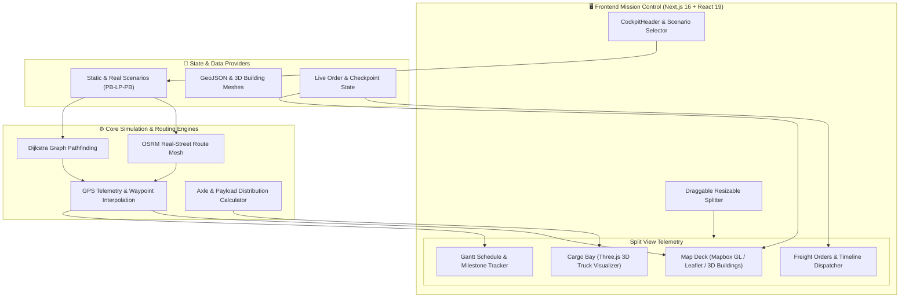
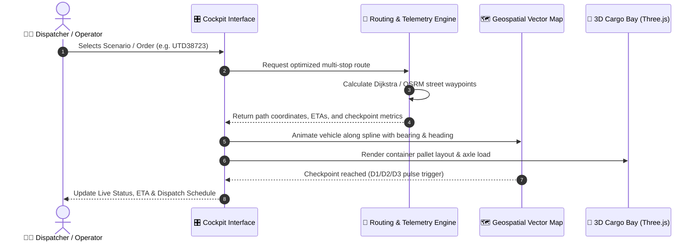

<div align="center">

# 🚛 FoxFreight | Intelligent Route & Fleet Cockpit

<p align="center">
  <strong>Next-Gen Autonomous Freight Logistics, Real-time 3D Cargo Telemetry & Geospatial Route Optimization</strong>
</p>

[](https://nextjs.org/)
[](https://react.dev/)
[](https://www.typescriptlang.org/)
[](https://threejs.org/)
[](https://www.mapbox.com/)
[](https://tailwindcss.com/)

<br/>

<div>
  <span style="background-color:#1e293b; color:#38bdf8; padding:4px 10px; border-radius:12px; font-weight:600; font-size:12px; border:1px solid #0284c7;">📍 Real-time OSRM / Dijkstra Routing</span>
  &nbsp;
  <span style="background-color:#1e293b; color:#facc15; padding:4px 10px; border-radius:12px; font-weight:600; font-size:12px; border:1px solid #ca8a04;">📦 3D WebGL Cargo Bay Visualizer</span>
  &nbsp;
  <span style="background-color:#1e293b; color:#4ade80; padding:4px 10px; border-radius:12px; font-weight:600; font-size:12px; border:1px solid #16a34a;">⚡ Live Dispatch Optimization</span>
  &nbsp;
  <span style="background-color:#1e293b; color:#c084fc; padding:4px 10px; border-radius:12px; font-weight:600; font-size:12px; border:1px solid #9333ea;">🌓 Dark / Light Mission Control</span>
</div>

</div>

---

## 📖 Overview

**FoxFreight** is an industrial-grade **Freight Management & Dispatcher Cockpit** engineered to give supply chain operators complete end-to-end visibility. It bridges real-time geospatial GPS telemetry, algorithmic route optimization (OSRM & Dijkstra graph search), volumetric 3D container loading, and Gantt-based operational scheduling into a unified high-performance mission control interface.

---

## 🏛️ System Architecture



---

## 🔄 Telemetry & Dispatch Data Flow



---

## ✨ Key Features

<table>
  <thead>
    <tr>
      <th width="30%">Feature</th>
      <th width="70%">Description</th>
    </tr>
  </thead>
  <tbody>
    <tr>
      <td><b>🗺️ Dynamic Geospatial Cockpit</b></td>
      <td>
        Interactive vector maps powered by <b>Mapbox GL & Leaflet</b> with custom 3D city building extrusions, dynamic radar ping animations, vehicle heading rotation, and multi-checkpoint milestone markers (Origin &rarr; D1 &rarr; D2 &rarr; D3 &rarr; Destination).
      </td>
    </tr>
    <tr>
      <td><b>📦 3D Interactive Cargo Bay</b></td>
      <td>
        Hardware-accelerated <b>Three.js WebGL</b> container visualizer offering interactive orbit controls, pallet arrangement modeling, payload capacity thresholds, and volumetric axle load balancing.
      </td>
    </tr>
    <tr>
      <td><b>⚡ Intelligent Route Optimizer</b></td>
      <td>
        Instant scenario switching with algorithmic pathfinding (<b>Dijkstra & OSRM</b>) calculating realistic turn-by-turn routes, congestion rerouting, fuel consumption metrics, and precise arrival windows.
      </td>
    </tr>
    <tr>
      <td><b>📋 Live Freight Orders Hub</b></td>
      <td>
        Full-featured order management pane with multi-status indicators (<code>Completed</code>, <code>In-Transit</code>, <code>Awaiting</code>), payload weight meters, customer destination timelines, and instant item filtering.
      </td>
    </tr>
    <tr>
      <td><b>📊 Gantt Schedule Tracker</b></td>
      <td>
        Real-time operational timeline charting driver shifts, milestone arrivals, checkpoint celebration pulses, and estimated turnaround schedules.
      </td>
    </tr>
    <tr>
      <td><b>🌓 Adaptive Theme & Split-Pane Layout</b></td>
      <td>
        Sleek <b>Industrial Dark Mode</b> and high-contrast light theme with a custom draggable splitter allowing real-time workspace reconfiguration between map telemetry and cargo operations.
      </td>
    </tr>
  </tbody>
</table>

---

## 🛠️ Technology Stack

<div align="center">

| Layer | Technologies |
| :--- | :--- |
| **Framework & Core** | `Next.js 16.3.4 (App Router, Turbopack)`, `React 19.2.8`, `TypeScript 5` |
| **3D Graphics & WebGL** | `Three.js`, `@types/three` |
| **Mapping & GIS** | `Mapbox GL`, `MapLibre GL`, `Leaflet`, `@mapbox/vector-tile`, `PBF` |
| **Styling & Design System** | `Vanilla CSS Design Tokens`, `Tailwind CSS v4`, `@tailwindcss/postcss` |
| **Iconography** | `Lucide React`, `@iconify-react/hugeicons`, `@iconify-react/iconoir` |

</div>

---

## 📂 Project Structure

```bash
track_route/
├── 📁 app/
│   ├── 📁 components/
│   │   ├── 📄 CockpitHeader.tsx        # Top navigation, scenario switcher & telemetry controls
│   │   ├── 📄 CockpitMap.tsx           # High-precision map deck with route rendering & checkpoint markers
│   │   ├── 📄 TrackingMap.tsx          # Real-time GPS vehicle tracking & animated radar pulse
│   │   ├── 📄 Truck3DViewer.tsx        # Three.js 3D container & pallet visualizer
│   │   ├── 📄 TruckLoadingPanel.tsx    # Cargo bay inspection and payload analytics
│   │   ├── 📄 FreightOrdersList.tsx    # Interactive order items list & status indicators
│   │   ├── 📄 GanttScheduleChart.tsx   # Milestone schedule & timeline chart
│   │   ├── 📄 StatusPanel.tsx          # Vehicle diagnostics, speed & fuel telemetry
│   │   └── 📄 ControlBar.tsx           # Playback simulation and speed controls
│   ├── 📁 lib/
│   │   ├── 📄 dijkstraRouting.ts       # Graph pathfinding algorithm
│   │   ├── 📄 realStreetRoute.ts       # OSRM coordinate transforms & spline generation
│   │   ├── 📄 scenarioRoutes.ts        # Dynamic multi-scenario dataset
│   │   ├── 📄 staticRoutes.ts          # Waypoint definitions & milestones
│   │   ├── 📄 delhi3DBuildings.ts      # 3D building geometry extrusions
│   │   └── 📄 useTracking.ts           # Custom React telemetry hook
│   ├── 📁 types/                       # TypeScript models & order interfaces
│   ├── 📄 layout.tsx                   # Root HTML layout & font declarations
│   ├── 📄 page.tsx                     # Main cockpit view & draggable split pane
│   └── 📄 globals.css                  # Custom design system & theme variables
├── 📄 package.json
├── 📄 tsconfig.json
└── 📄 README.md
```

---

## 🚀 Getting Started

### Prerequisites

- **Node.js**: `v20.x` or later
- **Package Manager**: `npm`, `pnpm`, or `yarn`

### Installation

1. **Clone the repository:**
   ```bash
   git clone https://github.com/mayank-dotcom/truck_tracker.git
   cd track_route
   ```

2. **Install dependencies:**
   ```bash
   npm install
   ```

3. **Start the development server:**
   ```bash
   npm run dev
   ```

4. **Launch the application:**
   Open [http://localhost:3000](http://localhost:3000) in your browser.

---

## 🎮 Interactive Controls & Shortcuts

- **Workspace Resizing**: Click and drag the vertical splitter bar between the map and cargo panel to adjust view widths. Double-click the splitter to reset to a balanced `50/50` split.
- **3D Camera Navigation**:
  - `Left Click + Drag`: Rotate / Orbit 3D container view
  - `Right Click + Drag`: Pan camera
  - `Scroll Wheel`: Zoom in / out
- **Scenario Testing**: Use the scenario dropdown in the top header to instantly switch between delivery routing scenarios (`PB-LP-PB Scenario`, standard routes, and high-density dispatch).
- **Theme Toggle**: Click the Sun/Moon icon in the header to switch between **Mission Control Dark** and **Daylight Light** themes.

---

## 📜 License

Distributed under the **MIT License**. See `LICENSE` for more information.

<div align="center">
  <sub>Built with ❤️ for High-Performance Freight Operations</sub>
</div>
